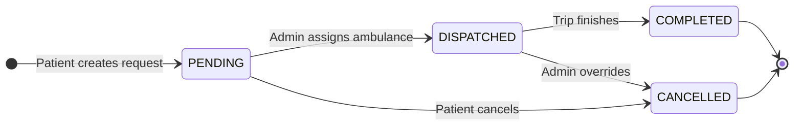

```mermaid
stateDiagram-v2
    direction LR

    [*] --> PENDING : Patient creates request
    PENDING --> DISPATCHED : Admin assigns ambulance
    PENDING --> CANCELLED : Patient cancels
    DISPATCHED --> COMPLETED : Trip finishes
    DISPATCHED --> CANCELLED : Admin overrides
    COMPLETED --> [*]
    CANCELLED --> [*]
```
