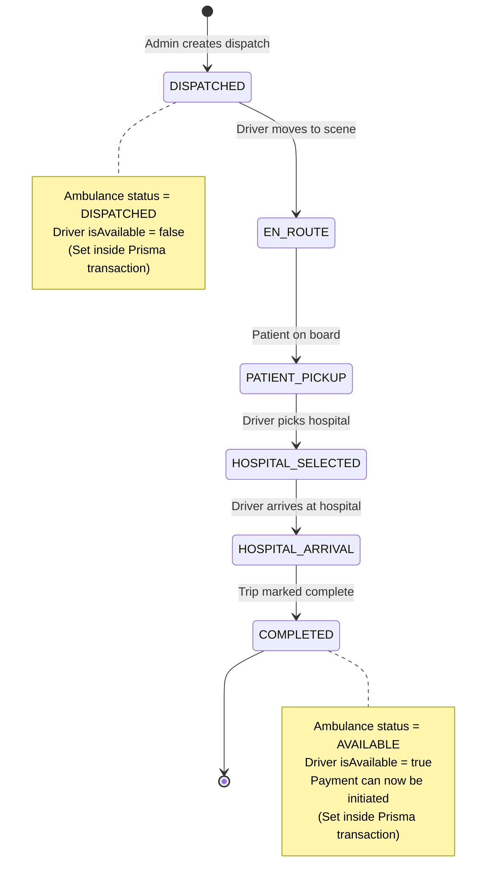

```mermaid
stateDiagram-v2
    direction TB

    [*] --> DISPATCHED : Admin creates dispatch

    DISPATCHED --> EN_ROUTE : Driver moves to scene
    EN_ROUTE --> PATIENT_PICKUP : Patient on board
    PATIENT_PICKUP --> HOSPITAL_SELECTED : Driver picks hospital
    HOSPITAL_SELECTED --> HOSPITAL_ARRIVAL : Driver arrives at hospital
    HOSPITAL_ARRIVAL --> COMPLETED : Trip marked complete
    COMPLETED --> [*]

    note right of DISPATCHED
        Ambulance status = DISPATCHED
        Driver isAvailable = false
        (Set inside Prisma transaction)
    end note

    note right of COMPLETED
        Ambulance status = AVAILABLE
        Driver isAvailable = true
        Payment can now be initiated
        (Set inside Prisma transaction)
    end note
```
