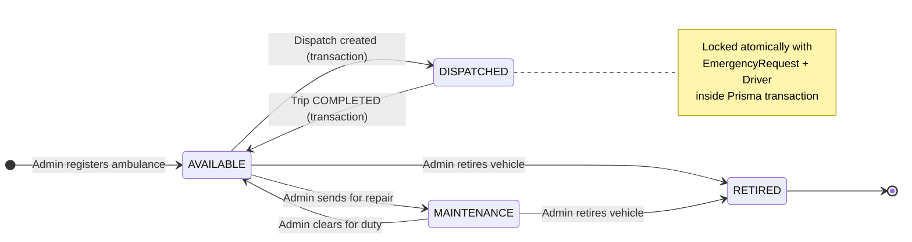

```mermaid
stateDiagram-v2
    direction LR

    [*] --> AVAILABLE : Admin registers ambulance

    AVAILABLE --> DISPATCHED : Dispatch created (transaction)
    DISPATCHED --> AVAILABLE : Trip COMPLETED (transaction)

    AVAILABLE --> MAINTENANCE : Admin sends for repair
    MAINTENANCE --> AVAILABLE : Admin clears for duty

    AVAILABLE --> RETIRED : Admin retires vehicle
    MAINTENANCE --> RETIRED : Admin retires vehicle
    RETIRED --> [*]

    note right of DISPATCHED
        Locked atomically with
        EmergencyRequest + Driver
        inside Prisma transaction
    end note
```
