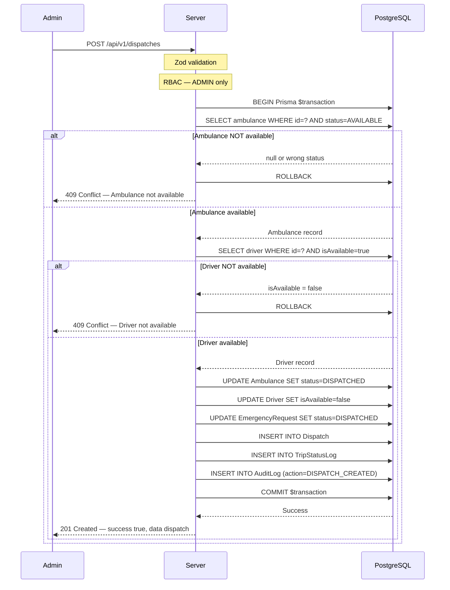

```mermaid
sequenceDiagram
    participant Admin
    participant Server
    participant DB as PostgreSQL

    Admin->>Server: POST /api/v1/dispatches
    Note over Server: Zod validation
    Note over Server: RBAC — ADMIN only

    Server->>DB: BEGIN Prisma $transaction
    Server->>DB: SELECT ambulance WHERE id=? AND status=AVAILABLE

    alt Ambulance NOT available
        DB-->>Server: null or wrong status
        Server->>DB: ROLLBACK
        Server-->>Admin: 409 Conflict — Ambulance not available
    else Ambulance available
        DB-->>Server: Ambulance record
        Server->>DB: SELECT driver WHERE id=? AND isAvailable=true

        alt Driver NOT available
            DB-->>Server: isAvailable = false
            Server->>DB: ROLLBACK
            Server-->>Admin: 409 Conflict — Driver not available
        else Driver available
            DB-->>Server: Driver record

            Server->>DB: UPDATE Ambulance SET status=DISPATCHED
            Server->>DB: UPDATE Driver SET isAvailable=false
            Server->>DB: UPDATE EmergencyRequest SET status=DISPATCHED
            Server->>DB: INSERT INTO Dispatch
            Server->>DB: INSERT INTO TripStatusLog
            Server->>DB: INSERT INTO AuditLog (action=DISPATCH_CREATED)

            Server->>DB: COMMIT $transaction
            DB-->>Server: Success

            Server-->>Admin: 201 Created — success true, data dispatch
        end
    end
```
