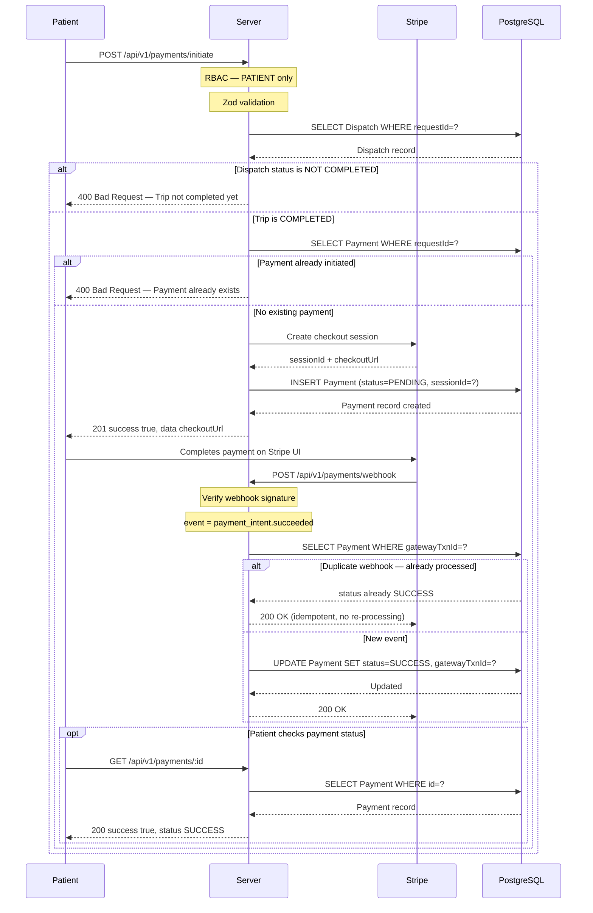

```mermaid
sequenceDiagram
    participant Patient
    participant Server
    participant Stripe
    participant DB as PostgreSQL

    Patient->>Server: POST /api/v1/payments/initiate
    Note over Server: RBAC — PATIENT only
    Note over Server: Zod validation

    Server->>DB: SELECT Dispatch WHERE requestId=?
    DB-->>Server: Dispatch record

    alt Dispatch status is NOT COMPLETED
        Server-->>Patient: 400 Bad Request — Trip not completed yet
    else Trip is COMPLETED
        Server->>DB: SELECT Payment WHERE requestId=?

        alt Payment already initiated
            Server-->>Patient: 400 Bad Request — Payment already exists
        else No existing payment
            Server->>Stripe: Create checkout session
            Stripe-->>Server: sessionId + checkoutUrl

            Server->>DB: INSERT Payment (status=PENDING, sessionId=?)
            DB-->>Server: Payment record created

            Server-->>Patient: 201 success true, data checkoutUrl

            Patient->>Stripe: Completes payment on Stripe UI

            Stripe->>Server: POST /api/v1/payments/webhook
            Note over Server: Verify webhook signature
            Note over Server: event = payment_intent.succeeded

            Server->>DB: SELECT Payment WHERE gatewayTxnId=?

            alt Duplicate webhook — already processed
                DB-->>Server: status already SUCCESS
                Server-->>Stripe: 200 OK (idempotent, no re-processing)
            else New event
                Server->>DB: UPDATE Payment SET status=SUCCESS, gatewayTxnId=?
                DB-->>Server: Updated
                Server-->>Stripe: 200 OK
            end

            opt Patient checks payment status
                Patient->>Server: GET /api/v1/payments/:id
                Server->>DB: SELECT Payment WHERE id=?
                DB-->>Server: Payment record
                Server-->>Patient: 200 success true, status SUCCESS
            end
        end
    end
```
