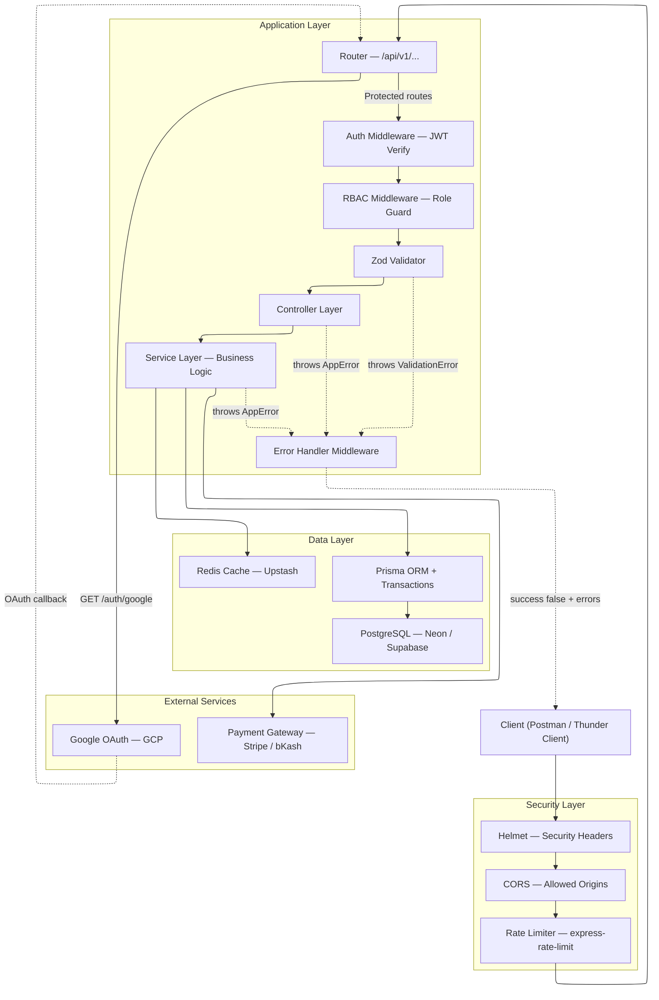

```mermaid
---
config:
  layout: elk
---
flowchart TD
    Client["Client (Postman / Thunder Client)"]

    subgraph Security["Security Layer"]
        Helmet["Helmet — Security Headers"]
        CORS["CORS — Allowed Origins"]
        RateLimit["Rate Limiter — express-rate-limit"]
    end

    subgraph AppLayer["Application Layer"]
        Router["Router — /api/v1/..."]
        Auth["Auth Middleware — JWT Verify"]
        RBAC["RBAC Middleware — Role Guard"]
        Zod["Zod Validator"]
        Controller["Controller Layer"]
        Service["Service Layer — Business Logic"]
        ErrorHandler["Error Handler Middleware"]
    end

    subgraph DataLayer["Data Layer"]
        Prisma["Prisma ORM + Transactions"]
        Redis["Redis Cache — Upstash"]
        PG["PostgreSQL — Neon / Supabase"]
    end

    subgraph External["External Services"]
        Payment["Payment Gateway — Stripe / bKash"]
        Google["Google OAuth — GCP"]
    end

    Client --> Helmet
    Helmet --> CORS
    CORS --> RateLimit
    RateLimit --> Router

    Router -->|Protected routes| Auth
    Router -->|GET /auth/google| Google
    Google -.->|OAuth callback| Router

    Auth --> RBAC
    RBAC --> Zod
    Zod --> Controller
    Controller --> Service
    Service --> Prisma
    Service --> Redis
    Prisma --> PG
    Service --> Payment

    Zod -.->|throws ValidationError| ErrorHandler
    Controller -.->|throws AppError| ErrorHandler
    Service -.->|throws AppError| ErrorHandler
    ErrorHandler -.->|success false + errors| Client
```
