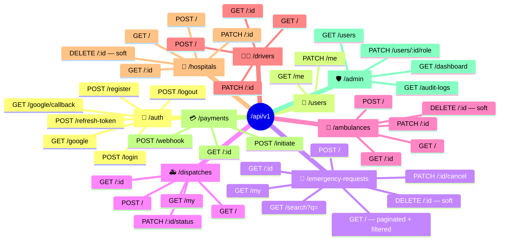

```mermaid
mindmap
  root(("/api/v1"))
    auth["🔐 /auth"]
      POST /register
      POST /login
      POST /logout
      POST /refresh-token
      GET /google
      GET /google/callback
    users["👤 /users"]
      GET /me
      PATCH /me
    emergency-requests["🚨 /emergency-requests"]
      POST /
      GET / — paginated + filtered
      GET /my
      GET /search?q=
      GET /:id
      PATCH /:id/cancel
      DELETE /:id — soft
    dispatches["🚑 /dispatches"]
      POST /
      GET /
      GET /my
      GET /:id
      PATCH /:id/status
    ambulances["🚐 /ambulances"]
      POST /
      GET /
      GET /:id
      PATCH /:id
      DELETE /:id — soft
    drivers["🧑‍✈️ /drivers"]
      POST /
      GET /
      GET /:id
      PATCH /:id
    hospitals["🏥 /hospitals"]
      POST /
      GET /
      GET /:id
      PATCH /:id
      DELETE /:id — soft
    payments["💳 /payments"]
      POST /initiate
      POST /webhook
      GET /:id
    admin["🛡️ /admin"]
      GET /dashboard
      GET /audit-logs
      GET /users
      PATCH /users/:id/role
```
