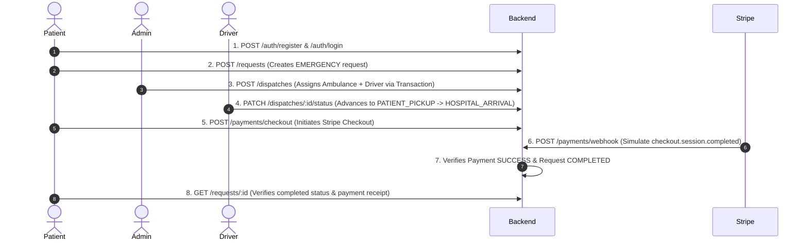

# 🧪 Testing Execution Plan — Unit, Integration & E2E Testing

**Project:** Emergency Ambulance Dispatch System  
**Framework Recommendation:** [Vitest](https://vitest.dev/) (blazing fast native TS/ESM support) + [Supertest](https://github.com/ladjs/supertest) (HTTP integration)

---

## 🎯 Testing Objectives & Pyramid Strategy

```
           / \
          /   \
         / E2E \       <-- Full User Flow (Auth ➜ Request ➜ Dispatch ➜ Payment)
        /-------\
       / Integr. \     <-- Route + Middleware + DB Transactions (Supertest)
      /-----------\
     /    Unit     \   <-- Utils, Zod Validators, Helper functions (Vitest)
    /---------------\
```

---

## 📦 Phase 1: Tooling & Setup

### 1.1 Install Dependencies
```bash
npm install -D vitest @vitest/coverage-v8 supertest @types/supertest dotenv-cli
```

### 1.2 Configuration Files
1. **`vitest.config.ts`**:
   - Environment: `node`
   - Setup files: `tests/setup.ts`
   - Root aliases and coverage thresholds (e.g. 80%+ coverage)
2. **`tests/setup.ts`**:
   - Loads test environment variables (`.env.test`)
   - Cleans DB / truncates test tables between suites if running integration tests
   - Mocks external network services by default (Cloudinary, Stripe webhook signatures)

### 1.3 NPM Scripts (`package.json`)
```json
"scripts": {
  "test": "vitest run",
  "test:watch": "vitest",
  "test:unit": "vitest run tests/unit",
  "test:integration": "dotenv -e .env.test -- vitest run tests/integration",
  "test:e2e": "dotenv -e .env.test -- vitest run tests/e2e",
  "test:coverage": "vitest run --coverage"
}
```

---

## 🔬 Phase 2: Unit Testing Plan (Pure Functions & Isolation)

> **Goal:** Test logic without hitting any external database or network.

### 2.1 Target Files & Test Cases

| Target File | Test Suite | Test Cases to Cover |
| :--- | :--- | :--- |
| [`src/utils/pagination.ts`](file:///c:/Users/Shuvo/Desktop/B7A6/src/utils/pagination.ts) | `tests/unit/utils/pagination.test.ts` | • Parses `page=2&limit=20` correctly (`skip=20`).<br>• Falls back to defaults (`page=1`, `limit=10`) on invalid query params.<br>• Caps maximum limit to 100.<br>• `buildMeta()` calculates `totalPages`, `hasNextPage`, `hasPrevPage`. |
| [`src/utils/response.ts`](file:///c:/Users/Shuvo/Desktop/B7A6/src/utils/response.ts) | `tests/unit/utils/response.test.ts` | • `sendSuccess()` formats payload `{ success: true, message, data }` and sends status code.<br>• `sendError()` formats error array structure. |
| [`src/utils/AppError.ts`](file:///c:/Users/Shuvo/Desktop/B7A6/src/utils/AppError.ts) | `tests/unit/utils/AppError.test.ts` | • Instantiates with correct `statusCode`, `isOperational=true`, and captures stack trace. |
| **Validators (Zod)**<br>`*.validator.ts` | `tests/unit/validators/*.test.ts` | • `auth.validator.ts`: Accepts valid emails and strong passwords; rejects short passwords.<br>• `payment.validator.ts`: Validates UUID `requestId` and amount ≥ 10.<br>• `dispatch.validator.ts`: Validates status transitions enum. |

---

## 🔗 Phase 3: Integration Testing Plan (API Routes + Middleware + Database)

> **Goal:** Test API routes end-to-end with express middlewares, RBAC guards, and database transactions using `Supertest`.

### 3.1 Target Modules & Test Suites

#### A. Auth & RBAC Module (`tests/integration/auth.test.ts`)
- `POST /api/v1/auth/register`
  - ✅ 201: Successfully creates user with hashed password.
  - ❌ 409: Rejects registration with existing email.
- `POST /api/v1/auth/login`
  - ✅ 200: Returns `accessToken` & `refreshToken`.
  - ❌ 401: Rejects invalid password.
- `RBAC Guard Test`
  - ❌ 403: Rejects `PATIENT` attempting to access `POST /api/v1/ambulances`.
  - ✅ 201: Allows `ADMIN` to create ambulances.

#### B. Dispatch Engine & Concurrency (`tests/integration/dispatch.test.ts`)
- `POST /api/v1/dispatches`
  - ✅ 201: Dispatches ambulance, marks driver `isAvailable: false`, and updates ambulance to `DISPATCHED`.
  - ❌ 400: Rejects dispatching an ambulance already in `MAINTENANCE` or `DISPATCHED` status.
  - ❌ 400: Rejects dispatching an unavailable driver.
- `PATCH /api/v1/dispatches/:id/status`
  - ✅ 200: Transitions through state machine (`EN_ROUTE` ➜ `PATIENT_PICKUP` ➜ `COMPLETED`).
  - ✅ 200: Automatically frees ambulance & driver (`AVAILABLE`) upon `COMPLETED`.

#### C. Payment Webhook (`tests/integration/payment.test.ts`)
- `POST /api/v1/payments/checkout`
  - ✅ 201: Creates checkout session and records `PENDING` payment.
  - ❌ 409: Rejects double checkout for an already paid request.
- `POST /api/v1/payments/webhook`
  - ✅ 200: Updates payment to `SUCCESS` and completes request when receiving signed `checkout.session.completed` event.
  - ❌ 400: Rejects requests with invalid or missing `stripe-signature`.

---

## 🌐 Phase 4: End-to-End (E2E) Testing Plan (Critical User Journeys)

> **Goal:** Test complete lifecycles simulating real-world operations from request creation to payment fulfillment.

### 4.1 Critical Path: The Emergency Life-Cycle (`tests/e2e/emergency-lifecycle.e2e.test.ts`)



---

## 📋 Directory Structure for Tests

```
tests/
├── setup.ts                           # Global setup, DB cleanup hooks
├── mocks/
│   ├── stripe.mock.ts                 # Stripe SDK mock
│   └── cloudinary.mock.ts             # Cloudinary stream mock
├── unit/
│   ├── utils/
│   │   ├── pagination.test.ts
│   │   ├── response.test.ts
│   │   └── AppError.test.ts
│   └── validators/
│       ├── auth.validator.test.ts
│       ├── payment.validator.test.ts
│       └── dispatch.validator.test.ts
├── integration/
│   ├── auth.test.ts
│   ├── ambulance.test.ts
│   ├── dispatch.test.ts
│   └── payment.test.ts
└── e2e/
    └── emergency-lifecycle.e2e.test.ts
```

---

## 🏁 Step-by-Step Implementation Roadmap

1. **Step 1:** Install `vitest`, `supertest`, `@vitest/coverage-v8`.
2. **Step 2:** Create `vitest.config.ts` and `tests/setup.ts`.
3. **Step 3:** Implement Unit Tests for all utils and Zod schemas.
4. **Step 4:** Implement Integration Tests with Supertest for Auth, Dispatch, and Payments.
5. **Step 5:** Implement the E2E lifecycle test suite.
6. **Step 6:** Configure CI / GitHub Action to run `npm test` automatically on Pull Requests.
